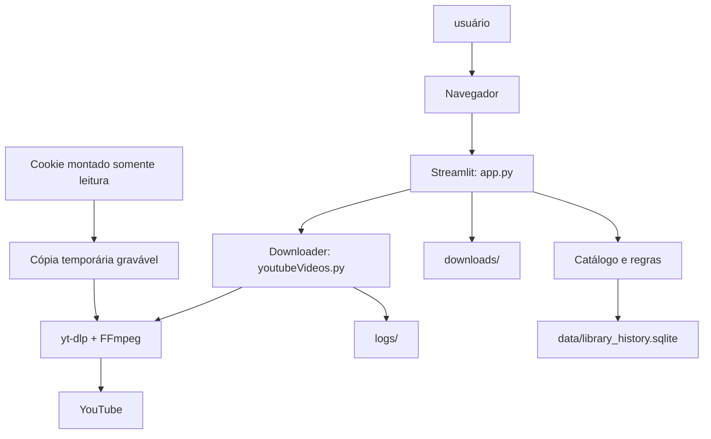
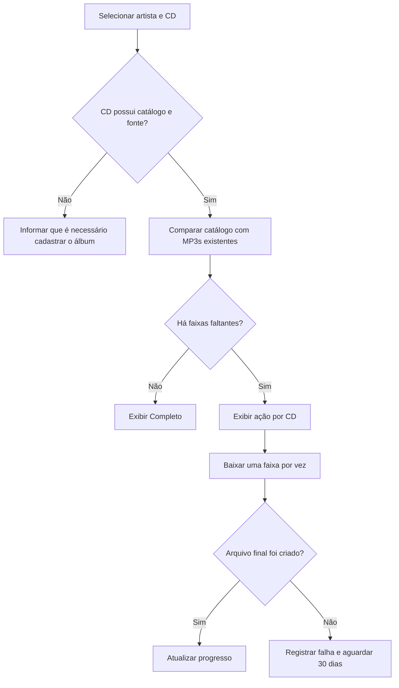
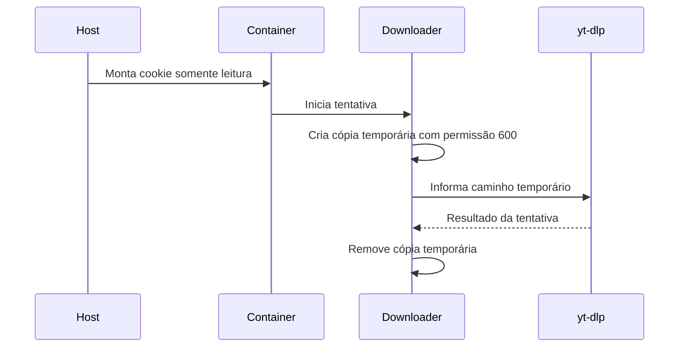

# Arquitetura — Biblioteca do Ariel

**Versão:** 1.0.0
**Data:** 27/07/2026
**Status:** Em uso
**Repositório:** `scriptDownloadYtb`

## 1. Propósito

A Biblioteca do Ariel organiza músicas para pendrive e reprodução automotiva. Ela permite cadastrar artistas e CDs, guardar fontes de download, baixar áudio para uma estrutura previsível e completar apenas as faixas que estiverem faltando.

O projeto prioriza previsibilidade: uma música já existente não deve ser baixada, movida, renomeada ou excluída sem uma ação explícita da usuário.

## 2. Escopo e limites

### Incluído

* Interface local em Streamlit para organizar a biblioteca.
* Download de áudio ou vídeo a partir de URLs do YouTube informadas ou cadastradas.
* Numeração de faixas para compatibilidade com aparelhos de carro.
* Catálogo de CDs, acompanhamento de completude e ação **Baixar músicas faltantes**.
* Logs, histórico persistente de falhas e bloqueio de nova tentativa da mesma fonte por 30 dias.
* Execução em container Docker, com dados persistidos no host.

### Não incluído

* Pesquisa automática e indiscriminada na internet por músicas.
* Login interativo no YouTube, armazenamento de senha ou envio de cookies ao repositório.
* Alteração dos MP3s já presentes em `downloads/`.
* Exposição pública da aplicação na internet.

## 3. Visão geral



O navegador acessa apenas o Streamlit. A aplicação delega a obtenção de mídia ao downloader, que usa `yt-dlp` e FFmpeg. Os arquivos de música, logs e histórico ficam fora da imagem Docker para sobreviver a recriações do container.

## 4. Componentes

| Componente         | Responsabilidade                                                                                    | Não deve fazer                                         |
| ------------------ | --------------------------------------------------------------------------------------------------- | ------------------------------------------------------ |
| `app.py`           | Interface, validação dos campos, exibição de progresso, biblioteca e mensagens amigáveis            | Executar lógica de extração do YouTube diretamente     |
| `youtubeVideos.py` | Montar opções do `yt-dlp`, executar download, validar arquivos finais e gerar resultado estruturado | Reportar sucesso se nenhum arquivo final foi criado    |
| `yt-dlp`           | Consultar URL, extrair metadados e baixar formatos disponíveis                                      | Persistir estado de negócio da biblioteca              |
| FFmpeg             | Converter o áudio final para MP3 quando selecionado                                                 | Definir nome, ordem ou completude do CD                |
| Catálogo de fontes | Relacionar artista, CD, faixa esperada e URLs aprovadas                                             | Inferir que uma fonte é oficial sem cadastro explícito |
| Histórico SQLite   | Registrar tentativas, falhas, data/hora e próxima data permitida                                    | Guardar cookies, senhas ou dados sensíveis             |

## 5. Fluxo de uso



### Regra de idempotência

Antes de baixar, a aplicação compara as faixas esperadas com os arquivos finais existentes no diretório do CD. Uma faixa encontrada não entra novamente na fila.

O resultado de uma tentativa só é considerado bem-sucedido quando há arquivo final novo no destino.

## 6. Estrutura de dados e arquivos

```text
scriptDownloadYtb/
├── app.py                       # Interface Streamlit
├── youtubeVideos.py             # Downloader reutilizável
├── Dockerfile
├── docker-compose.yml
├── downloads/                   # Biblioteca persistente; não versionar
│   └── <Artista>/<AAAA - Álbum>/
│       └── 01 - Título.mp3
├── logs/                        # Logs persistentes; não versionar
├── data/
│   └── library_history.sqlite   # Histórico operacional; não versionar
├── docs/
│   └── architecture.md
└── tests/
```

### Convenção de nomes

* **Artista:** nome legível, por exemplo `Disturbed`.
* **CD:** `AAAA - Nome do Álbum`, por exemplo `2000 - The Sickness`.
* **Faixa:** `NN - Título.mp3`, com dois dígitos, por exemplo `08 - Want.mp3`.

A numeração é parte do contrato da biblioteca: ela preserva a sequência em aparelhos que ordenam arquivos alfabeticamente.

## 7. Modelo de domínio

| Entidade  | Campos essenciais                                    | Finalidade                                              |
| --------- | ---------------------------------------------------- | ------------------------------------------------------- |
| Artista   | `nome`                                               | Agrupa CDs na biblioteca                                |
| Álbum     | `artista`, `ano`, `titulo`, `diretorio`              | Define a pasta de destino e a lista de faixas esperadas |
| Faixa     | `numero`, `titulo`, `normalizado`                    | Permite comparar catálogo e MP3 existente               |
| Fonte     | `url` canônica, `video_id`, `tipo`, `origem`, `prioridade`, `status` | Indica playlist ou URL individual utilizável            |
| Tentativa | `data_hora`, `faixa`, `url`, `resultado`, `mensagem` | Auditoria operacional                                   |
| Bloqueio  | `url`, `proxima_tentativa_em`, `motivo`              | Evita repetir automaticamente a mesma falha             |

Uma playlist pode ser uma fonte de álbum. Uma URL individual é uma fonte de faixa.

A aplicação só deve preencher automaticamente URLs que já estejam no catálogo; uma URL digitada manualmente é marcada como não verificada até ser revisada.

## 8. Estados e resultado final

| Estado       | Regra                                                  | Ação para a usuário                             |
| ------------ | ------------------------------------------------------ | ------------------------------------------------------ |
| `SUCESSO`    | Todos os itens solicitados geraram arquivos finais     | Conferir a biblioteca                                  |
| `PARCIAL`    | Pelo menos um arquivo foi criado, mas houve falhas     | Consultar faixas faltantes e histórico                 |
| `FALHA`      | Nenhum arquivo solicitado foi criado                   | Corrigir a fonte ou aguardar o prazo de nova tentativa |
| Completo     | Arquivos existentes cobrem todas as faixas do catálogo | Não exibir ação de download faltante                   |
| Incompleto   | Há catálogo e uma ou mais faixas ausentes              | Exibir **Baixar músicas faltantes**                    |
| Sem catálogo | Não há lista de faixas esperadas                       | Solicitar cadastro do CD e de sua fonte                |

`PARCIAL` e `FALHA` retornam código de saída `1` no modo de linha de comando. Isso permite que testes e automações reconheçam corretamente uma falha.

## 9. Falhas, tentativas e mensagens

O detalhe técnico vai para os logs. A interface traduz os erros para mensagens práticas.

| Situação técnica          | Mensagem na interface                               | Registro no histórico               |
| ------------------------- | --------------------------------------------------- | ----------------------------------- |
| HTTP 429                  | “O YouTube limitou temporariamente esta tentativa.” | URL, data/hora, tipo `limite`       |
| Confirmação de robô       | “A fonte precisa de uma sessão válida do YouTube.”  | URL, data/hora, tipo `autenticacao` |
| Vídeo privado ou removido | “Esta fonte não está disponível.”                   | URL, data/hora, tipo `indisponivel` |
| Formato inexistente       | “Não foi encontrado áudio disponível nesta fonte.”  | URL, data/hora, tipo `formato`      |

Após uma falha, a mesma URL não é tentada novamente antes de 30 dias. Se existir outra fonte cadastrada para a mesma faixa, ela pode ser oferecida imediatamente.

O histórico serve para aprendizado operacional futuro; não é, por enquanto, um modelo de *machine learning*.

## 10. Cookies e segurança

Cookies são opcionais e pertencem à conta da usuário. Eles não entram no Git, não aparecem em logs e não devem ser enviados por chat.

No Docker, o arquivo do host é montado somente para leitura. Antes de chamar o `yt-dlp`, o downloader deve copiar o arquivo para um caminho temporário gravável, com permissão `600`, e usar somente essa cópia durante a tentativa.

Isso evita o erro de sistema de arquivos somente leitura e preserva o segredo original.



## 11. Operação local

O serviço é destinado ao acesso local do servidor. A porta publicada deve permanecer vinculada a `127.0.0.1`.

Para abrir no computador Windows via VS Code Remote/SSH, utilize o encaminhamento de porta do VS Code.

```bash
docker compose up -d --build
docker compose ps
docker compose logs --tail=100 musica-library
```

Para parar somente a biblioteca:

```bash
docker compose stop musica-library
```

## 12. Qualidade e testes

As validações não devem chamar o YouTube nem baixar mídia real.

O conjunto mínimo de qualidade é:

```bash
python3 -m py_compile youtubeVideos.py
python3 youtubeVideos.py --help
pytest -q
git diff --check
docker compose config
```

Os testes devem cobrir pelo menos:

* Retorno `SUCESSO`, `PARCIAL` e `FALHA`.
* Validação de arquivo final criado.
* Detecção de playlist por `list=`.
* Não duplicação de MP3 já existente.
* Seleção exata das faixas faltantes.
* Bloqueio de repetição de fonte antes de 30 dias.
* Mensagens amigáveis para falhas conhecidas.
* Montagem e leitura de configuração Docker, sem exigir navegador externo.

O teste automatizado de saúde é executado no servidor.

A abertura pelo navegador Windows é uma validação manual de aceitação, pois depende do encaminhamento de portas do VS Code.

## 13. Decisões arquiteturais

| Decisão                    | Motivo                                         | Consequência                                           |
| -------------------------- | ---------------------------------------------- | ------------------------------------------------------ |
| Streamlit local            | Interface simples para uma biblioteca pessoal  | Não deve ser exposto publicamente sem autenticação     |
| Docker com volumes         | Preservar músicas, logs e histórico em rebuild | Dados não devem ficar apenas dentro da imagem          |
| MP3 numerado               | Compatibilidade com carro e pendrive           | Renomeação precisa ser deliberada e testada            |
| SQLite para histórico      | Pouca complexidade e persistência local        | Sem concorrência alta ou compartilhamento multiusuário |
| Fontes cadastradas         | Evitar URL errada, ao vivo ou duplicada        | Novo álbum precisa de revisão inicial                  |
| Reprocessamento em 30 dias | Evitar repetição de bloqueios e ruído          | Falhas urgentes exigem nova fonte, não repetição cega  |

## 14. Checklist de manutenção

Antes de liberar uma alteração:

* [ ] Confirmar que nenhum MP3 existente foi alterado indevidamente.
* [ ] Confirmar que `downloads/`, `logs/`, banco SQLite e cookies estão ignorados pelo Git.
* [ ] Executar as validações da seção 12.
* [ ] Fazer um teste manual sem download real.
* [ ] Atualizar o `README` quando o fluxo de uso mudar.
* [ ] Fazer commit pequeno, com uma finalidade clara.

## 15. Changelog do documento

| Versão | Data       | Alteração                                                                                                      |
| ------ | ---------- | -------------------------------------------------------------------------------------------------------------- |
| 1.0.0  | 27/07/2026 | Primeira arquitetura da Biblioteca do Ariel, incluindo catálogo, faixas faltantes, histórico e operação local. |
